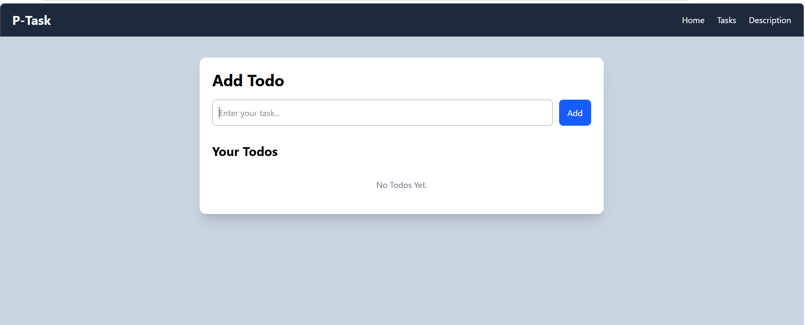
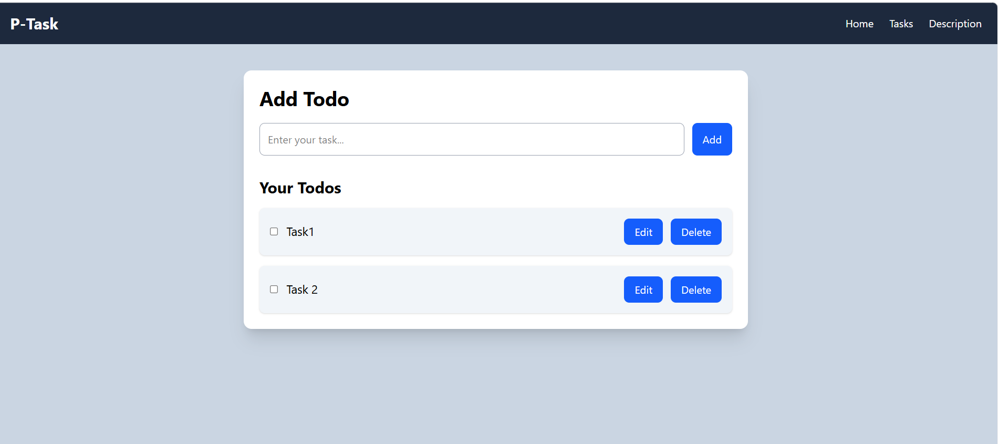

# P-Task

A simple todo list application to manage your daily tasks.

## Preview

**Empty State**


**With Tasks**


## Features
- Add Todo
- Edit Todo
- Delete Todo

## Technologies Used
- React
- JavaScript
- Vite
- CSS

## Project Structure
```
src/
 ├── components/
 ├── pages/
 ├── assets/
 └── App.jsx
```

## Getting Started

Install dependencies
```bash
npm install
```

Start the project
```bash
npm run dev
```

## Author
Piyush Dohare
